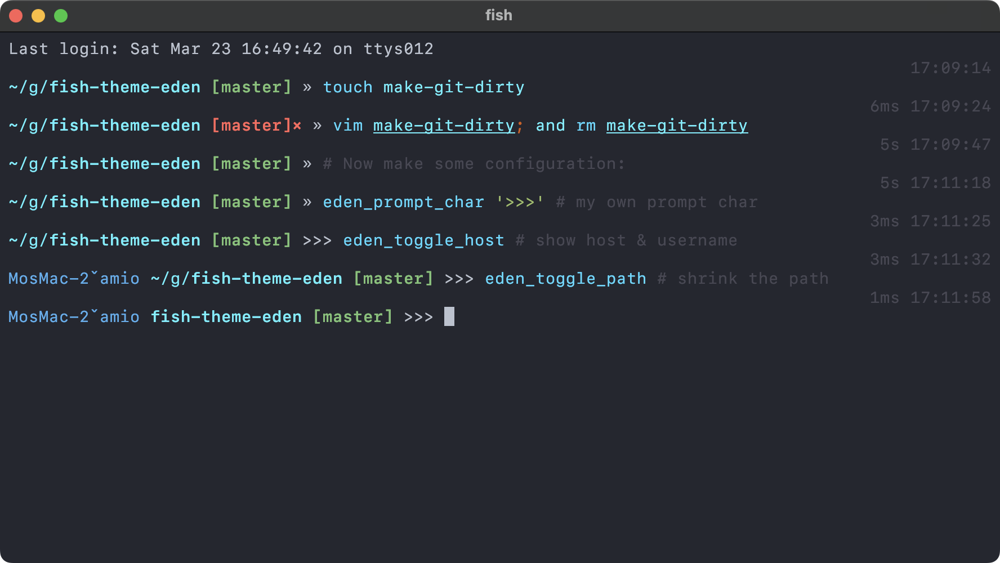

# Eden

A theme for [Fish](https://fishshell.com) with Git status and a right-aligned summary of the last command.

## Install

With [Oh My Fish](https://github.com/oh-my-fish/oh-my-fish):

```fish
omf install eden
```

Remove it with `omf remove eden`.

With [Fisher](https://github.com/jorgebucaran/fisher):

```fish
fisher install amio/fish-theme-eden
```

Remove it with `fisher remove amio/fish-theme-eden`.

## Features

- After each command, a line above the next prompt shows its completion time, duration, and nonzero exit status on the right.
- The left prompt starts on a new line directly below the command summary, or after a blank line when there is no summary. It shows the current directory and Git branch, with a marker for uncommitted changes.
- Linked Git worktrees use braces, for example `{feature}`, while the main checkout uses brackets, for example `[feature]`. A detached HEAD shows `detached@` followed by the short commit ID, for example `{detached@abc1234}` in a linked worktree or `[detached@abc1234]` in the main checkout. Clean Git labels are green; uncommitted changes turn them red and add `×`.
- `eden_toggle_path` switches between an abbreviated path with the last two directories shown in full and the current directory alone.
- `eden_toggle_host` shows or hides the host and user.
- `eden_prompt_char` sets a custom prompt character; run it without an argument to restore `»`.
- `eden_toggle_ssh_tag` shows or hides the `-SSH-` tag on SSH connections. The tag is red for root and blue otherwise.

## Screenshot



## Development

Run `fish --no-config tests/smoke.fish` to check prompt formatting and Git status detection.

## License

[MIT](LICENSE) © [Amio](https://github.com/amio)
